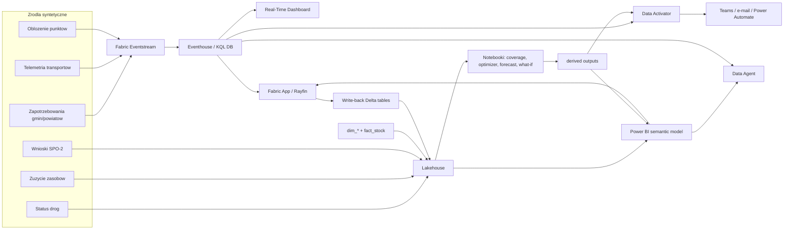

# Architektura rozwiązania

> Dokument opisuje architekturę demonstratora „Rezerwy i Zasoby — Logistyka Kryzysowa”. Dane są syntetyczne, ale wzorzec architektoniczny odpowiada rozmowie z decydentem oraz z zespołem technicznym odpowiedzialnym za wdrożenie.

## Założenie architektoniczne

Architektura rozdziela dwa rytmy pracy kryzysowej. Pierwszy to **rytm strumieniowy**: transport zmienia pozycję, punkt przyjęcia zapełnia się, droga staje się nieprzejezdna, a gmina składa nowe zapotrzebowanie. Drugi to **rytm analityczny**: stany magazynowe i zużycie są agregowane, notebook liczy pokrycie, optymalizator proponuje plan, a prognoza wskazuje wyczerpanie zasobów. Microsoft Fabric jest użyty jako wspólna platforma dla obu rytmów.

Najważniejsza zasada: **algorytm rekomenduje, człowiek decyduje**. Optimizer skraca średni czas dostawy z 4.27 h do 1.70 h, ale decyzja o wydaniu zasobu jest zatwierdzana przez uprawnioną rolę: wojewodę, RCB albo Agencję Rezerw Strategicznych. To jest istotne dla zaufania i zgodności z systemem zarządzania kryzysowego.

## Diagram

## Warstwa źródeł danych

W repo źródłami są pliki syntetyczne: `dim_*`, `fact_*` oraz zdarzenia JSONL. W prawdziwym wdrożeniu analogiczne zasilanie pochodziłoby z systemów ARS, magazynów wojewódzkich OC, PSP, WOT, WCZK, systemów finansowych, danych drogowych i formularzy samorządowych. W demie celowo utrzymano proste formaty CSV/JSONL, bo ułatwiają audyt i szybkie uruchomienie bez infrastruktury.

## Warstwa Lakehouse

Lakehouse jest źródłem prawdy dla danych wsadowych: słowniki administracyjne, katalog zasobów, stany magazynowe, punkty przyjęcia, środki transportu, dostawcy, wnioski SPO-2 oraz wyniki notebooków. W repo mamy 2 477 gmin, 380 powiatów, 60 magazynów, 400 punktów przyjęcia i 1 200 rekordów stanów. W Fabric pliki powinny być skonwertowane do Delta tables, aby obsługiwać odświeżanie, wersjonowanie i write-back.

Uzasadnienie wyboru: Lakehouse łączy pliki, tabele i notebooki w jednym miejscu. Pozwala na szybkie rozpoczęcie od danych plikowych, a potem przejście do bardziej produkcyjnego modelu medallion: bronze dla surowych zasileń, silver dla ujednoliconych tabel, gold dla raportowania i aplikacji.

## Warstwa strumieniowa: Eventstream i Eventhouse

Eventstream przyjmuje strumienie `fact_transport_tracking`, `fact_shelter_occupancy` i `fact_demand`. Lokalny dry-run wybiera 22 261 zdarzeń. W produkcji Eventstream mógłby dostać Custom App endpoint, Azure Event Hub albo konektor do systemu transportowego.

Eventhouse / KQL DB obsługuje pytania „co dzieje się teraz”. Funkcje `CurrentTransportPositions()` i `CurrentShelterOccupancy()` używają `arg_max(timestamp, *)`, aby pokazać bieżący stan bez ręcznego przeglądania historii. KQL jest też naturalny dla alertów: transport >30 min, punkt >90%, priorytet 1 >2h bez obsługi, droga nieprzejezdna.

## Warstwa analityczna: Notebooki

Notebook `02_coverage_analysis.py` liczy najbliższe magazyny i czas dojazdu dla gmin dotkniętych. Wynik: 226 gmin, średnio 0.97 h, P90 1.52 h. Notebook `03_allocation_optimizer.py` jest sercem demo: porównuje FIFO i plan optymalny. Notebook `04_depletion_forecast.py` liczy dni zapasu; w danych występują 23 kombinacje zasób/województwo poniżej 2 dni, najniższy odczyt to 0.2 dnia dla R17 w województwie 02. `05_whatif_simulation.py` daje narracje alternatywne: fala we Wrocławiu, droga A4 nieprzejezdna, zapotrzebowanie +50%.

## Warstwa decyzji: Power BI i Real-Time Dashboard

Power BI jest ekranem decyzyjnym. Pokazuje kraj, województwa, czasy dostępu, zapotrzebowania, realizację, punkty przyjęcia, prognozę i finanse SPO-2. Real-Time Dashboard jest ekranem dyżurnego: nie opowiada całego procesu, tylko pokazuje, co wymaga reakcji teraz. Obie warstwy korzystają z tych samych danych, ale odpowiadają na inne pytania.

## Warstwa działania: Fabric App / Rayfin

Fabric App jest kluczowa, bo zamienia analizę w działanie. Użytkownik składa wniosek, akceptuje, eskaluje, zatwierdza rekomendację, potwierdza odbiór i tworzy wniosek SPO-2. Write-back trafia do tabel Delta, a historia decyzji do `audit_log`. Dzięki temu po demo można rozliczyć, kto kliknął, dlaczego i na podstawie jakich danych.

## Alerty i AI

Data Activator zamienia progi w powiadomienia. W danych mamy 42 transporty z opóźnieniem >30 min, 149 punktów >90% i 37 wniosków SPO-2 powyżej 5 mln PLN. Data Agent pozwala pytać po polsku: „ile agregatów mamy w dolnośląskim”, „które punkty są przepełnione”, „jaki jest efekt optymalizatora”. Agent cytuje tabele i nie podejmuje decyzji.

## Co byłoby inaczej w prawdziwym wdrożeniu

1. **Integracje systemowe.** Zasilanie z systemów ARS, PSP, WOT, wojewódzkich centrów zarządzania kryzysowego, systemów finansowych, GDDKiA i dostawców. Pliki CSV byłyby etapem przejściowym.
2. **Bezpieczeństwo i klasyfikacja.** RBAC, etykiety Purview, audyt, szyfrowanie, separacja środowisk, klasyfikacja informacji i procedury dostępu kryzysowego.
3. **Ciągłość działania.** Tryb offline formularzy, kolejki zdarzeń, retry, deduplikacja, kopie regionalne i procedura pracy przy braku łączności.
4. **Jakość danych.** Confidence score, last refresh, walidacja stanów fizycznych, uzgadnianie z magazynem i podpisy elektroniczne.
5. **Model optymalizacji.** Produkcyjnie optimizer uwzględniałby okna czasowe, załogi, dostępność paliwa, typ pojazdu, kontrakty i ograniczenia prawne.
6. **Proces formalny.** Decyzje byłyby powiązane z dokumentami KPZK, SPO-2, obiegiem kancelaryjnym i archiwizacją.

## Dlaczego architektura działa na decydenta

Decydent nie ogląda zestawu technologii, tylko pętlę działania: wójt zgłasza → wojewoda eskaluje → RCB/ARS widzi rekomendację → człowiek akceptuje → transport jest monitorowany → alert wymusza reakcję → prognoza uzasadnia rezerwy i SPO-2. Każdy komponent Fabric ma jasną rolę w tej pętli.
