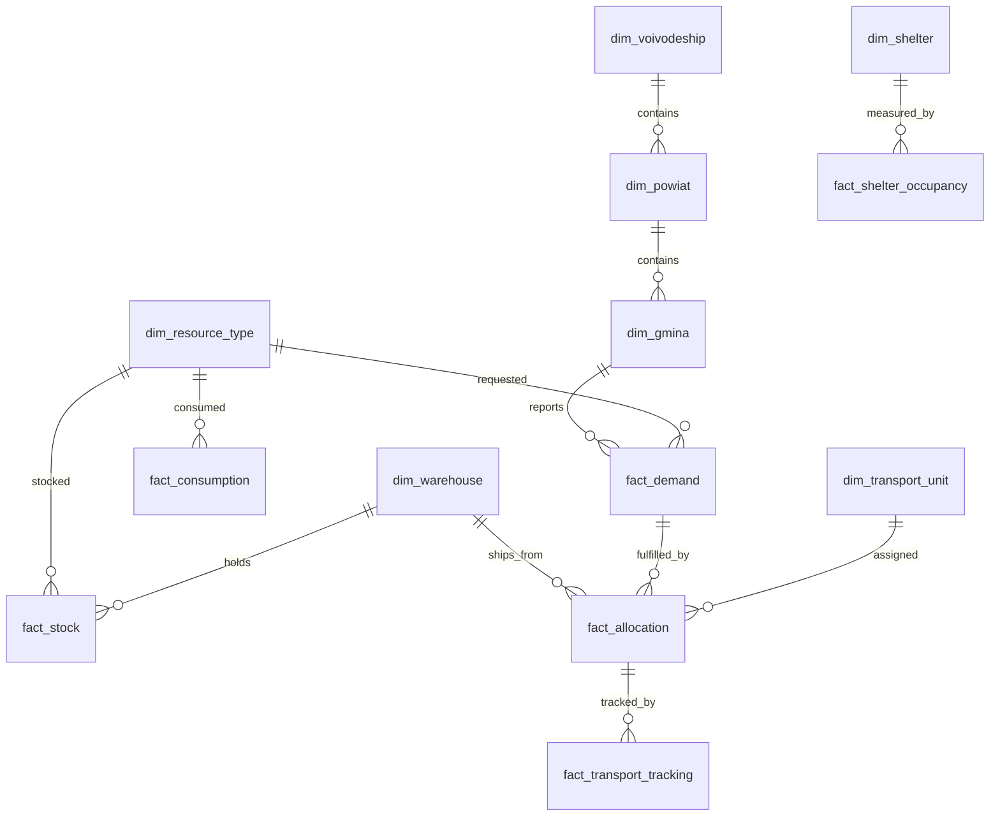

# Model danych

Dokument opisuje każdą tabelę i strumień demo. Dane są syntetyczne, UTF-8, deterministyczne (`seed=42`). Kody TERYT są syntetyczne, ale zachowują strukturę województwo/powiat/gmina. Nazwy techniczne są po angielsku i bez polskich znaków.

## Diagram relacji



## Logika generowania

Generator tworzy 16 województw, 380 powiatów i 2 477 gmin. Magazyny są typu ARS, wojewódzkie OC, PSP i WOT. Zasoby obejmują 20 typów: agregaty, pompy, łóżka, koce, wodę, racje, namioty, nagrzewnice, worki, osuszacze, generatory medyczne, karetki, śmigłowce, amfibie, mosty pontonowe, paliwo, leki/opatrunki, uzdatnianie wody, radiotelefony i terminale satelitarne.

Wyczerpywanie magazynów jest modelowane przez niższe stany startowe w najbardziej obciążonych województwach oraz przez `fact_consumption`. Notebook prognozy agreguje stany i średnie zużycie, a następnie liczy `days_of_stock`. W aktualnych wynikach są 23 kombinacje zasób/województwo z zapasem poniżej 2 dni, a najniższy odczyt to 0.2 dnia dla R17 w województwie 02.

Wpływ dróg jest modelowany przez `fact_road_status`. Status `utrudnienia` zwiększa czas, a `nieprzejezdna` podnosi koszt trasy i powinna generować alert. W danych jest 58 odcinków z utrudnieniami lub nieprzejezdnych, w tym 11 nieprzejezdnych. Coverage i optimizer uwzględniają tę korektę w czasie dostawy.

## Zasady jakości danych

Każdy rekord ma klucz techniczny lub timestamp. Kody TERYT należy traktować jako tekst, aby nie tracić zer wiodących. Daty są ISO-8601 z offsetem +02:00. Dane są demonstracyjne: nie należy ich łączyć z rzeczywistymi rejestrami bez wyraźnego oznaczenia środowiska i klasyfikacji informacji.

## `dim_voivodeship.csv`

**Ziarno:** jeden rekord = województwo.  
**Liczba rekordów:** 16.

| Kolumna | Typ | Opis | Przykład | Wartości dopuszczalne |
|---|---|---|---|---|
| `voivodeship_code` | integer | Syntetyczny kod województwa TERYT, 2 znaki. | `2` | zakres 2…32 |
| `voivodeship_name` | string/datetime | Nazwa województwa w konwencji technicznej. | `dolnoslaskie` | identyfikator, tekst lub wartość słownikowa |
| `lat` | real | Szerokość geograficzna. | `51.11` | zakres 50.04…54.35 |
| `lon` | real | Długość geograficzna. | `17.03` | zakres 14.55…23.16 |

**Przykładowy rekord:**

```json
{
  "voivodeship_code": 2,
  "voivodeship_name": "dolnoslaskie",
  "lat": 51.11,
  "lon": 17.03
}
```

**Użycie w demie:** tabela zasila raport, aplikację albo zapytania KQL. W prezentacji warto wskazać, że pole techniczne jest stabilne i może być mapowane na system źródłowy.

## `dim_powiat.csv`

**Ziarno:** jeden rekord = powiat.  
**Liczba rekordów:** 380.

| Kolumna | Typ | Opis | Przykład | Wartości dopuszczalne |
|---|---|---|---|---|
| `powiat_code` | integer | Syntetyczny kod powiatu TERYT, 4 znaki. | `201` | zakres 201…3221 |
| `powiat_name` | string/datetime | Nazwa powiatu lub nazwa syntetyczna. | `klodzki` | identyfikator, tekst lub wartość słownikowa |
| `voivodeship_code` | integer | Syntetyczny kod województwa TERYT, 2 znaki. | `2` | zakres 2…32 |
| `lat` | real | Szerokość geograficzna. | `51.23798` | zakres 48.77321…55.12259 |
| `lon` | real | Długość geograficzna. | `16.45801` | zakres 13.64482…24.82308 |

**Przykładowy rekord:**

```json
{
  "powiat_code": 201,
  "powiat_name": "klodzki",
  "voivodeship_code": 2,
  "lat": 51.23798,
  "lon": 16.45801
}
```

**Użycie w demie:** tabela zasila raport, aplikację albo zapytania KQL. W prezentacji warto wskazać, że pole techniczne jest stabilne i może być mapowane na system źródłowy.

## `dim_gmina.csv`

**Ziarno:** jeden rekord = gmina.  
**Liczba rekordów:** 2477.

| Kolumna | Typ | Opis | Przykład | Wartości dopuszczalne |
|---|---|---|---|---|
| `gmina_code` | integer | Syntetyczny kod gminy TERYT, 7 znaków. | `201001` | zakres 201001…3221009 |
| `gmina_name` | string/datetime | Nazwa gminy, dla części obszaru prawdziwa nazwa scenariuszowa. | `Klodzko` | identyfikator, tekst lub wartość słownikowa |
| `powiat_code` | integer | Syntetyczny kod powiatu TERYT, 4 znaki. | `201` | zakres 201…3221 |
| `voivodeship_code` | integer | Syntetyczny kod województwa TERYT, 2 znaki. | `2` | zakres 2…32 |
| `population` | integer | Syntetyczna ludność gminy. | `7489` | zakres 1854…67965 |
| `lat` | real | Szerokość geograficzna. | `50.98435` | zakres 48.51527…55.32013 |
| `lon` | real | Długość geograficzna. | `16.24966` | zakres 13.44841…25.11698 |

**Przykładowy rekord:**

```json
{
  "gmina_code": 201001,
  "gmina_name": "Klodzko",
  "powiat_code": 201,
  "voivodeship_code": 2,
  "population": 7489,
  "lat": 50.98435,
  "lon": 16.24966
}
```

**Użycie w demie:** tabela zasila raport, aplikację albo zapytania KQL. W prezentacji warto wskazać, że pole techniczne jest stabilne i może być mapowane na system źródłowy.

## `dim_resource_type.csv`

**Ziarno:** jeden rekord = typ zasobu.  
**Liczba rekordów:** 20.

| Kolumna | Typ | Opis | Przykład | Wartości dopuszczalne |
|---|---|---|---|---|
| `resource_type_id` | string/datetime | Identyfikator zasobu R01…R20. | `R01` | identyfikator, tekst lub wartość słownikowa |
| `resource_name` | string/datetime | Nazwa zasobu bez polskich znaków. | `agregaty_pradotworcze` | identyfikator, tekst lub wartość słownikowa |
| `unit` | string/datetime | Jednostka miary. | `kW` | identyfikator, tekst lub wartość słownikowa |
| `category` | string/datetime | Kategoria logistyczna. | `energia` | identyfikator, tekst lub wartość słownikowa |
| `weight_kg` | real | Masa jednostkowa. | `850.0` | zakres 0.84…9000.0 |
| `volume_m3` | real | Kubatura jednostkowa. | `3.0` | zakres 0.001…30.0 |
| `requires_operator` | integer | Czy zasób wymaga obsługi. | `1` | 1, 0 |
| `setup_time_h` | real | Czas rozstawienia. | `2.0` | zakres 0.0…4.0 |

**Przykładowy rekord:**

```json
{
  "resource_type_id": "R01",
  "resource_name": "agregaty_pradotworcze",
  "unit": "kW",
  "category": "energia",
  "weight_kg": 850.0,
  "volume_m3": 3.0,
  "requires_operator": 1,
  "setup_time_h": 2.0
}
```

**Użycie w demie:** tabela zasila raport, aplikację albo zapytania KQL. W prezentacji warto wskazać, że pole techniczne jest stabilne i może być mapowane na system źródłowy.

## `dim_warehouse.csv`

**Ziarno:** jeden rekord = magazyn.  
**Liczba rekordów:** 60.

| Kolumna | Typ | Opis | Przykład | Wartości dopuszczalne |
|---|---|---|---|---|
| `warehouse_id` | string/datetime | Identyfikator magazynu. | `WH001` | identyfikator, tekst lub wartość słownikowa |
| `warehouse_name` | string/datetime | Pole używane w relacjach, filtrach lub wizualizacjach. | `ARS_dolnoslaskie_01` | identyfikator, tekst lub wartość słownikowa |
| `owner_type` | string/datetime | Pole używane w relacjach, filtrach lub wizualizacjach. | `ARS` | ARS, magazyn_wojewodzki_OC, skladnica_PSP, magazyn_WOT |
| `voivodeship_code` | integer | Syntetyczny kod województwa TERYT, 2 znaki. | `2` | zakres 2…32 |
| `lat` | real | Szerokość geograficzna. | `51.1595` | zakres 49.39534…54.19372 |
| `lon` | real | Długość geograficzna. | `16.86087` | zakres 14.00741…23.60308 |
| `area_m2` | integer | Pole używane w relacjach, filtrach lub wizualizacjach. | `9130` | zakres 857…11820 |
| `has_ramp` | integer | Pole używane w relacjach, filtrach lub wizualizacjach. | `1` | 1, 0 |
| `available_24_7` | integer | Pole używane w relacjach, filtrach lub wizualizacjach. | `1` | 1, 0 |

**Przykładowy rekord:**

```json
{
  "warehouse_id": "WH001",
  "warehouse_name": "ARS_dolnoslaskie_01",
  "owner_type": "ARS",
  "voivodeship_code": 2,
  "lat": 51.1595,
  "lon": 16.86087,
  "area_m2": 9130,
  "has_ramp": 1,
  "available_24_7": 1
}
```

**Użycie w demie:** tabela zasila raport, aplikację albo zapytania KQL. W prezentacji warto wskazać, że pole techniczne jest stabilne i może być mapowane na system źródłowy.

## `dim_shelter.csv`

**Ziarno:** jeden rekord = punkt przyjęcia.  
**Liczba rekordów:** 400.

| Kolumna | Typ | Opis | Przykład | Wartości dopuszczalne |
|---|---|---|---|---|
| `shelter_id` | string/datetime | Pole używane w relacjach, filtrach lub wizualizacjach. | `SH0001` | identyfikator, tekst lub wartość słownikowa |
| `shelter_name` | string/datetime | Pole używane w relacjach, filtrach lub wizualizacjach. | `punkt_przyjecia_0001` | identyfikator, tekst lub wartość słownikowa |
| `shelter_type` | string/datetime | Pole używane w relacjach, filtrach lub wizualizacjach. | `osrodek` | osrodek, szkola, hala, internat |
| `gmina_code` | integer | Syntetyczny kod gminy TERYT, 7 znaków. | `224004` | zakres 201001…3221006 |
| `capacity` | integer | Pojemność punktu. | `489` | zakres 62…647 |
| `has_kitchen` | integer | Pole używane w relacjach, filtrach lub wizualizacjach. | `1` | 1, 0 |
| `has_medical_room` | integer | Pole używane w relacjach, filtrach lub wizualizacjach. | `0` | 0, 1 |
| `accessible_disabled` | integer | Pole używane w relacjach, filtrach lub wizualizacjach. | `0` | 0, 1 |
| `lat` | real | Szerokość geograficzna. | `51.33022` | zakres 49.37772…54.84159 |
| `lon` | real | Długość geograficzna. | `16.85885` | zakres 13.51785…24.91395 |

**Przykładowy rekord:**

```json
{
  "shelter_id": "SH0001",
  "shelter_name": "punkt_przyjecia_0001",
  "shelter_type": "osrodek",
  "gmina_code": 224004,
  "capacity": 489,
  "has_kitchen": 1,
  "has_medical_room": 0,
  "accessible_disabled": 0,
  "lat": 51.33022,
  "lon": 16.85885
}
```

**Użycie w demie:** tabela zasila raport, aplikację albo zapytania KQL. W prezentacji warto wskazać, że pole techniczne jest stabilne i może być mapowane na system źródłowy.

## `dim_transport_unit.csv`

**Ziarno:** jeden rekord = środek transportu.  
**Liczba rekordów:** 180.

| Kolumna | Typ | Opis | Przykład | Wartości dopuszczalne |
|---|---|---|---|---|
| `transport_unit_id` | string/datetime | Pole używane w relacjach, filtrach lub wizualizacjach. | `TU0001` | identyfikator, tekst lub wartość słownikowa |
| `transport_type` | string/datetime | Pole używane w relacjach, filtrach lub wizualizacjach. | `amfibia` | amfibia, naczepa_niskopodwoziowa, bus, ciezarowka_24t, ciezarowka_12t, smiglowiec |
| `payload_t` | integer | Pole używane w relacjach, filtrach lub wizualizacjach. | `8` | 8, 40, 2, 24, 12, 3 |
| `avg_speed_kmh` | integer | Pole używane w relacjach, filtrach lub wizualizacjach. | `25` | 25, 45, 70, 52, 58, 160 |
| `base_warehouse_id` | string/datetime | Pole używane w relacjach, filtrach lub wizualizacjach. | `WH019` | identyfikator, tekst lub wartość słownikowa |
| `available_from` | string/datetime | Pole używane w relacjach, filtrach lub wizualizacjach. | `2026-09-15T12:00:00+02:00` | identyfikator, tekst lub wartość słownikowa |
| `available` | integer | Pole używane w relacjach, filtrach lub wizualizacjach. | `1` | 1, 0 |

**Przykładowy rekord:**

```json
{
  "transport_unit_id": "TU0001",
  "transport_type": "amfibia",
  "payload_t": 8,
  "avg_speed_kmh": 25,
  "base_warehouse_id": "WH019",
  "available_from": "2026-09-15T12:00:00+02:00",
  "available": 1
}
```

**Użycie w demie:** tabela zasila raport, aplikację albo zapytania KQL. W prezentacji warto wskazać, że pole techniczne jest stabilne i może być mapowane na system źródłowy.

## `dim_supplier.csv`

**Ziarno:** jeden rekord = dostawca.  
**Liczba rekordów:** 45.

| Kolumna | Typ | Opis | Przykład | Wartości dopuszczalne |
|---|---|---|---|---|
| `supplier_id` | string/datetime | Pole używane w relacjach, filtrach lub wizualizacjach. | `SUP001` | identyfikator, tekst lub wartość słownikowa |
| `supplier_name` | string/datetime | Pole używane w relacjach, filtrach lub wizualizacjach. | `dostawca_ramowy_001` | identyfikator, tekst lub wartość słownikowa |
| `category` | string/datetime | Kategoria logistyczna. | `lacznosc` | identyfikator, tekst lub wartość słownikowa |
| `voivodeship_code` | integer | Syntetyczny kod województwa TERYT, 2 znaki. | `4` | zakres 4…32 |
| `lead_time_h` | integer | Pole używane w relacjach, filtrach lub wizualizacjach. | `38` | zakres 17…93 |
| `contract_limit` | integer | Pole używane w relacjach, filtrach lub wizualizacjach. | `441344` | zakres 60478…2468491 |

**Przykładowy rekord:**

```json
{
  "supplier_id": "SUP001",
  "supplier_name": "dostawca_ramowy_001",
  "category": "lacznosc",
  "voivodeship_code": 4,
  "lead_time_h": 38,
  "contract_limit": 441344
}
```

**Użycie w demie:** tabela zasila raport, aplikację albo zapytania KQL. W prezentacji warto wskazać, że pole techniczne jest stabilne i może być mapowane na system źródłowy.

## `fact_stock.csv`

**Ziarno:** jeden rekord = magazyn x typ zasobu.  
**Liczba rekordów:** 1200.

| Kolumna | Typ | Opis | Przykład | Wartości dopuszczalne |
|---|---|---|---|---|
| `warehouse_id` | string/datetime | Identyfikator magazynu. | `WH001` | identyfikator, tekst lub wartość słownikowa |
| `resource_type_id` | string/datetime | Identyfikator zasobu R01…R20. | `R01` | identyfikator, tekst lub wartość słownikowa |
| `available_qty` | integer | Ilość dostępna. | `158` | zakres 11…9369 |
| `reserved_qty` | integer | Ilość zarezerwowana. | `18` | zakres 0…1150 |
| `in_transit_qty` | integer | Ilość w drodze. | `7` | zakres 0…552 |
| `expiry_date` | string/datetime | Data ważności dla żywności i leków. | `2027-07-15` | identyfikator, tekst lub wartość słownikowa |

**Przykładowy rekord:**

```json
{
  "warehouse_id": "WH001",
  "resource_type_id": "R01",
  "available_qty": 158,
  "reserved_qty": 18,
  "in_transit_qty": 7,
  "expiry_date": NaN
}
```

**Użycie w demie:** tabela zasila raport, aplikację albo zapytania KQL. W prezentacji warto wskazać, że pole techniczne jest stabilne i może być mapowane na system źródłowy.

## `fact_financial_request.csv`

**Ziarno:** jeden rekord = wniosek SPO-2.  
**Liczba rekordów:** 90.

| Kolumna | Typ | Opis | Przykład | Wartości dopuszczalne |
|---|---|---|---|---|
| `financial_request_id` | string/datetime | Pole używane w relacjach, filtrach lub wizualizacjach. | `FIN0001` | identyfikator, tekst lub wartość słownikowa |
| `timestamp` | string/datetime | Czas w ISO-8601 +02:00. | `2026-09-24T00:00:00+02:00` | identyfikator, tekst lub wartość słownikowa |
| `applicant` | string/datetime | Pole używane w relacjach, filtrach lub wizualizacjach. | `starosta` | starosta, wojewoda, minister_wiodacy |
| `voivodeship_code` | integer | Syntetyczny kod województwa TERYT, 2 znaki. | `16` | 16, 24, 8, 2, 30 |
| `amount_pln` | integer | Kwota w PLN. | `3451816` | zakres 128801…8439525 |
| `purpose` | string/datetime | Pole używane w relacjach, filtrach lub wizualizacjach. | `odtworzenie_sil_i_srodkow` | odtworzenie_sil_i_srodkow, zakup_wody_i_zywnosci, zakup_paliwa, transport_rezerw, zakwaterowanie_ewakuowanych |
| `status` | string/datetime | Status operacyjny. | `RZZK_opinion` | identyfikator, tekst lub wartość słownikowa |
| `approval_path` | string/datetime | Pole używane w relacjach, filtrach lub wizualizacjach. | `wojewoda>minister_wiodacy>RZZK>MF` | wojewoda>minister_wiodacy>RZZK>MF |

**Przykładowy rekord:**

```json
{
  "financial_request_id": "FIN0001",
  "timestamp": "2026-09-24T00:00:00+02:00",
  "applicant": "starosta",
  "voivodeship_code": 16,
  "amount_pln": 3451816,
  "purpose": "odtworzenie_sil_i_srodkow",
  "status": "RZZK_opinion",
  "approval_path": "wojewoda>minister_wiodacy>RZZK>MF"
}
```

**Użycie w demie:** tabela zasila raport, aplikację albo zapytania KQL. W prezentacji warto wskazać, że pole techniczne jest stabilne i może być mapowane na system źródłowy.

## `fact_demand.jsonl`

**Ziarno:** jeden rekord = zapotrzebowanie.  
**Liczba rekordów:** 960.

| Kolumna | Typ | Opis | Przykład | Wartości dopuszczalne |
|---|---|---|---|---|
| `demand_id` | string/datetime | Pole używane w relacjach, filtrach lub wizualizacjach. | `DEM00001` | identyfikator, tekst lub wartość słownikowa |
| `timestamp` | string/datetime | Czas w ISO-8601 +02:00. | `2026-09-15 16:45:00+02:00` | identyfikator, tekst lub wartość słownikowa |
| `day_label` | string/datetime | Pole używane w relacjach, filtrach lub wizualizacjach. | `D+0` | identyfikator, tekst lub wartość słownikowa |
| `gmina_code` | integer | Syntetyczny kod gminy TERYT, 7 znaków. | `218005` | zakres 201001…807004 |
| `powiat_code` | integer | Syntetyczny kod powiatu TERYT, 4 znaki. | `218` | zakres 201…807 |
| `voivodeship_code` | integer | Syntetyczny kod województwa TERYT, 2 znaki. | `2` | 2, 8 |
| `resource_type_id` | string/datetime | Identyfikator zasobu R01…R20. | `R16` | identyfikator, tekst lub wartość słownikowa |
| `quantity` | integer | Ilość zapotrzebowana. | `287` | zakres 5…3822 |
| `priority` | integer | Priorytet 1–4. | `2` | 2, 3, 4, 1 |
| `justification` | string/datetime | Pole używane w relacjach, filtrach lub wizualizacjach. | `brak_zasilania` | brak_zasilania, zalane_ujecie_wody, ewakuacja_ludnosci, punkt_przyjecia, przelane_waly |
| `reported_by` | string/datetime | Pole używane w relacjach, filtrach lub wizualizacjach. | `starosta` | starosta, burmistrz, wojt, PCZK |

**Przykładowy rekord:**

```json
{
  "demand_id": "DEM00001",
  "timestamp": "2026-09-15 16:45:00+02:00",
  "day_label": "D+0",
  "gmina_code": 218005,
  "powiat_code": 218,
  "voivodeship_code": 2,
  "resource_type_id": "R16",
  "quantity": 287,
  "priority": 2,
  "justification": "brak_zasilania",
  "reported_by": "starosta"
}
```

**Użycie w demie:** tabela zasila raport, aplikację albo zapytania KQL. W prezentacji warto wskazać, że pole techniczne jest stabilne i może być mapowane na system źródłowy.

## `fact_allocation.jsonl`

**Ziarno:** jeden rekord = decyzja przydziału.  
**Liczba rekordów:** 520.

| Kolumna | Typ | Opis | Przykład | Wartości dopuszczalne |
|---|---|---|---|---|
| `allocation_id` | string/datetime | Pole używane w relacjach, filtrach lub wizualizacjach. | `ALC00001` | identyfikator, tekst lub wartość słownikowa |
| `demand_id` | string/datetime | Pole używane w relacjach, filtrach lub wizualizacjach. | `DEM00001` | identyfikator, tekst lub wartość słownikowa |
| `warehouse_id` | string/datetime | Identyfikator magazynu. | `WH003` | identyfikator, tekst lub wartość słownikowa |
| `allocated_qty` | integer | Pole używane w relacjach, filtrach lub wizualizacjach. | `287` | zakres 3…990 |
| `transport_unit_id` | string/datetime | Pole używane w relacjach, filtrach lub wizualizacjach. | `TR00001` | identyfikator, tekst lub wartość słownikowa |
| `eta` | string/datetime | Pole używane w relacjach, filtrach lub wizualizacjach. | `2026-09-15T20:38:03.739293+02:00` | identyfikator, tekst lub wartość słownikowa |
| `status` | string/datetime | Status operacyjny. | `planned` | planned, delivered, in_transit, accepted, delayed |
| `decision_level` | string/datetime | Pole używane w relacjach, filtrach lub wizualizacjach. | `wojewoda` | wojewoda, ARS, RZZK, RCB |

**Przykładowy rekord:**

```json
{
  "allocation_id": "ALC00001",
  "demand_id": "DEM00001",
  "warehouse_id": "WH003",
  "allocated_qty": 287,
  "transport_unit_id": "TR00001",
  "eta": "2026-09-15T20:38:03.739293+02:00",
  "status": "planned",
  "decision_level": "wojewoda"
}
```

**Użycie w demie:** tabela zasila raport, aplikację albo zapytania KQL. W prezentacji warto wskazać, że pole techniczne jest stabilne i może być mapowane na system źródłowy.

## `fact_transport_tracking.jsonl`

**Ziarno:** jeden rekord = punkt telemetryczny.  
**Liczba rekordów:** 16901.

| Kolumna | Typ | Opis | Przykład | Wartości dopuszczalne |
|---|---|---|---|---|
| `transport_id` | string/datetime | Pole używane w relacjach, filtrach lub wizualizacjach. | `TR00001` | identyfikator, tekst lub wartość słownikowa |
| `allocation_id` | string/datetime | Pole używane w relacjach, filtrach lub wizualizacjach. | `ALC00001` | identyfikator, tekst lub wartość słownikowa |
| `timestamp` | string/datetime | Czas w ISO-8601 +02:00. | `2026-09-15 18:44:53.029971+02:00` | identyfikator, tekst lub wartość słownikowa |
| `lat` | real | Szerokość geograficzna. | `51.52201` | zakres 50.27373…53.75241 |
| `lon` | real | Długość geograficzna. | `17.33367` | zakres 14.00986…19.68932 |
| `speed_kmh` | real | Pole używane w relacjach, filtrach lub wizualizacjach. | `48.7` | zakres 0.0…108.6 |
| `eta` | string/datetime | Pole używane w relacjach, filtrach lub wizualizacjach. | `2026-09-15T20:50:03.739293+02:00` | identyfikator, tekst lub wartość słownikowa |
| `status` | string/datetime | Status operacyjny. | `in_transit` | in_transit, delivered, delayed |
| `delay_min` | integer | Opóźnienie w minutach. | `12` | zakres 0…89 |

**Przykładowy rekord:**

```json
{
  "transport_id": "TR00001",
  "allocation_id": "ALC00001",
  "timestamp": "2026-09-15 18:44:53.029971+02:00",
  "lat": 51.52201,
  "lon": 17.33367,
  "speed_kmh": 48.7,
  "eta": "2026-09-15T20:50:03.739293+02:00",
  "status": "in_transit",
  "delay_min": 12
}
```

**Użycie w demie:** tabela zasila raport, aplikację albo zapytania KQL. W prezentacji warto wskazać, że pole techniczne jest stabilne i może być mapowane na system źródłowy.

## `fact_shelter_occupancy.jsonl`

**Ziarno:** jeden rekord = pomiar obłożenia.  
**Liczba rekordów:** 4400.

| Kolumna | Typ | Opis | Przykład | Wartości dopuszczalne |
|---|---|---|---|---|
| `shelter_id` | string/datetime | Pole używane w relacjach, filtrach lub wizualizacjach. | `SH0001` | identyfikator, tekst lub wartość słownikowa |
| `timestamp` | string/datetime | Czas w ISO-8601 +02:00. | `2026-09-16 02:00:00+02:00` | identyfikator, tekst lub wartość słownikowa |
| `capacity` | integer | Pojemność punktu. | `489` | zakres 62…647 |
| `occupied` | integer | Liczba osób w punkcie. | `110` | zakres 0…644 |
| `medical_care_required` | integer | Pole używane w relacjach, filtrach lub wizualizacjach. | `3` | zakres 0…83 |

**Przykładowy rekord:**

```json
{
  "shelter_id": "SH0001",
  "timestamp": "2026-09-16 02:00:00+02:00",
  "capacity": 489,
  "occupied": 110,
  "medical_care_required": 3
}
```

**Użycie w demie:** tabela zasila raport, aplikację albo zapytania KQL. W prezentacji warto wskazać, że pole techniczne jest stabilne i może być mapowane na system źródłowy.

## `fact_consumption.jsonl`

**Ziarno:** jeden rekord = zużycie zasobu.  
**Liczba rekordów:** 14300.

| Kolumna | Typ | Opis | Przykład | Wartości dopuszczalne |
|---|---|---|---|---|
| `site_id` | string/datetime | Pole używane w relacjach, filtrach lub wizualizacjach. | `SH0264` | identyfikator, tekst lub wartość słownikowa |
| `timestamp` | string/datetime | Czas w ISO-8601 +02:00. | `2026-09-16 04:00:00+02:00` | identyfikator, tekst lub wartość słownikowa |
| `resource_type_id` | string/datetime | Identyfikator zasobu R01…R20. | `R05` | R05, R06, R04, R17, R16 |
| `consumed_qty` | integer | Pole używane w relacjach, filtrach lub wizualizacjach. | `21` | zakres 2…94 |
| `voivodeship_code` | integer | Syntetyczny kod województwa TERYT, 2 znaki. | `30` | zakres 2…32 |

**Przykładowy rekord:**

```json
{
  "site_id": "SH0264",
  "timestamp": "2026-09-16 04:00:00+02:00",
  "resource_type_id": "R05",
  "consumed_qty": 21,
  "voivodeship_code": 30
}
```

**Użycie w demie:** tabela zasila raport, aplikację albo zapytania KQL. W prezentacji warto wskazać, że pole techniczne jest stabilne i może być mapowane na system źródłowy.

## `fact_road_status.jsonl`

**Ziarno:** jeden rekord = status drogi.  
**Liczba rekordów:** 260.

| Kolumna | Typ | Opis | Przykład | Wartości dopuszczalne |
|---|---|---|---|---|
| `road_segment_id` | string/datetime | Pole używane w relacjach, filtrach lub wizualizacjach. | `RD0001` | identyfikator, tekst lub wartość słownikowa |
| `voivodeship_code` | integer | Syntetyczny kod województwa TERYT, 2 znaki. | `8` | zakres 2…32 |
| `road_name` | string/datetime | Pole używane w relacjach, filtrach lub wizualizacjach. | `DW381` | identyfikator, tekst lub wartość słownikowa |
| `status` | string/datetime | Status operacyjny. | `przejezdna` | przejezdna, nieprzejezdna, utrudnienia |
| `reason` | string/datetime | Pole używane w relacjach, filtrach lub wizualizacjach. | `zalanie` | zalanie, korek_ewakuacyjny, uszkodzony_most, brak, osuwisko |
| `lat` | real | Szerokość geograficzna. | `53.01763` | zakres 48.24845…55.57452 |
| `lon` | real | Długość geograficzna. | `14.97754` | zakres 13.8627…24.28384 |
| `timestamp` | string/datetime | Czas w ISO-8601 +02:00. | `2026-09-22 18:00:00+02:00` | identyfikator, tekst lub wartość słownikowa |

**Przykładowy rekord:**

```json
{
  "road_segment_id": "RD0001",
  "voivodeship_code": 8,
  "road_name": "DW381",
  "status": "przejezdna",
  "reason": "zalanie",
  "lat": 53.01763,
  "lon": 14.97754,
  "timestamp": "2026-09-22 18:00:00+02:00"
}
```

**Użycie w demie:** tabela zasila raport, aplikację albo zapytania KQL. W prezentacji warto wskazać, że pole techniczne jest stabilne i może być mapowane na system źródłowy.
