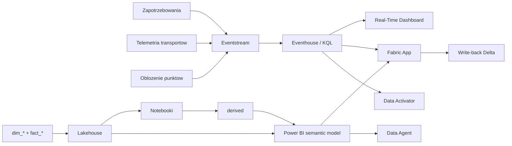

# 🚚 Rezerwy i Zasoby — Logistyka Kryzysowa

**Microsoft Fabric Real-Time Intelligence + Power BI + Fabric Apps — krajowy obraz zasobów, zapotrzebowań i transportów w scenariuszu powodziowym.**

> ⚠️ **Disclaimer** — repozytorium demonstracyjne. Wszystkie dane są w 100% syntetyczne, wygenerowane proceduralnie (`generate_datasets.py`, seed=42) i nie stanowią danych operacyjnych żadnej instytucji.

## Problem biznesowy i kontekst prawny

W czasie kryzysu decydent pyta: **czym dysponujemy, gdzie to jest, ile czasu zajmie dostarczenie i czy wystarczy**. W praktyce odpowiedź bywa rozproszona: osobne arkusze, telefony do magazynów, brak wspólnego widoku transportów, brak aktualnego obłożenia punktów przyjęcia i brak powiązania decyzji logistycznej z finansowaniem.

Demo pokazuje, jak Microsoft Fabric może zbudować jeden obraz operacyjny dla scenariusza **„POWÓDŹ WRZESIEŃ”**: dorzecze Odry i Nysy Kłodzkiej, oś czasu D0…D+10, perspektywa RCB / RZZK / Agencji Rezerw Strategicznych / wojewodów. Zgodnie z konwencjami programu uwzględniono Z02 Powódź oraz współzagrożenia Z07, Z12 i Z20. Ścieżka reagowania to gmina → powiat → wojewoda → minister → RZZK, a finansowanie dodatkowe jest pokazane przez **SPO-2 Uruchomienie dodatkowych środków finansowych**.

## Dla kogo jest to demo

- **Dyrektor RCB / RZZK** — potrzebuje jednego obrazu kraju i uzasadnienia rekomendacji.
- **Wojewoda / WCZK** — potrzebuje kolejki wniosków, eskalacji i informacji, czy lokalne zasoby wystarczą.
- **Agencja Rezerw Strategicznych** — potrzebuje planu wydania zasobów, ETA i prognozy uzupełnień.
- **Samorząd** — potrzebuje prostego formularza zapotrzebowania i potwierdzenia odbioru.
- **Zespół danych / IT** — dostaje strukturę repo, KQL, notebooki, model semantyczny i specyfikację aplikacji.

## Najważniejszy argument: optimizer

Notebook `notebooks\03_allocation_optimizer.py` porównuje ręczny FIFO z optymalizacją. Wynik z aktualnych danych:

| Metryka | FIFO | Optymalizacja |
|---|---:|---:|
| Średni czas dostawy | **4.27 h** | **1.70 h** |
| Oszczędność czasu | — | **2.57 h** |
| Obsłużone zapotrzebowania | 420 | 420 |
| Priorytet 1 obsłużony | 100.0% | **100.0%** |

To główny „moment decyzyjny”: system nie zastępuje człowieka, ale skraca przygotowanie decyzji i pokazuje lepszy plan. Roboczy koszt operacji planu optymalizacyjnego wynosi około **32 467 865 PLN**. Unikalne gminy z zapotrzebowaniami obejmują syntetyczną populację **7 931 435 osób**.

## Architektura



Szczegóły są w `ARCHITECTURE.md`, a źródłowy diagram w `architecture.mmd`.

## Stan wdrożenia

Scenariusz **działa na Microsoft Fabric** w obszarze roboczym `OL-ZK-Demo-Zasoby`: Lakehouse
(21 tabel Delta), Eventhouse z ingestią strumieniową, Eventstream `es_log_transport`, model
semantyczny Direct Lake (35 miar), raport `OL_LOG_Raport` (6 stron), Real-Time Dashboard
(20 kafelków), Activator, Data Agent `agent_zasoby_logistyka` i aplikacja `pulpit-zasobow`.

Identyfikatory elementów, adres aplikacji, zweryfikowane liczności i napotkane problemy:
`DEPLOYMENT_STATUS.md`. Odtworzenie środowiska krok po kroku: `SETUP_FABRIC.md`.

## Zawartość repozytorium

| Ścieżka | Opis |
|---|---|
| `generate_datasets.py` | Generator danych syntetycznych. |
| `simulate_realtime.py` | Symulator Eventstream; `--dry-run` bez zależności Azure. |
| `deploy\` | Skrypty wdrożeniowe Fabric (items, KQL, notatniki, model, raport, dashboard, Activator, Data Agent, Eventstream). |
| `scenario\` | Silnik odtwarzania osi czasu dla demonstracji na żywo. |
| `datasets\` | CSV/JSONL i wyniki `derived`. |
| `kql\01_create_tables.kql` | Tabele i mappingi KQL. |
| `kql\02_update_policies.kql` | Funkcje bieżącego stanu. |
| `kql\03_dashboard_queries.kql` | Kafelki Real-Time Dashboard. |
| `kql\04_alerts.kql` | Alerty KQL / Activator. |
| `notebooks\` | Coverage, optimizer, forecast, what-if. |
| `semantic-model\` | Model i miary DAX. |
| `report\REPORT_SPEC.md` | Specyfikacja raportu Power BI. |
| `fabric-app\` | Specyfikacja aplikacji i prompt Rayfin. |
| `activator\RULES.md` | Reguły alertowe. |
| `ai\DATA_AGENT.md` | Instrukcje Data Agent. |
| `fabric-app\pulpit-zasobow\` | Kod wdrożonej aplikacji (React + Rayfin). |

## Rzeczywiste liczby rekordów

| Plik | Rekordy |
|---|---:|
| `dim_gmina.csv` | 2477 |
| `dim_powiat.csv` | 380 |
| `dim_resource_type.csv` | 20 |
| `dim_shelter.csv` | 400 |
| `dim_supplier.csv` | 45 |
| `dim_transport_unit.csv` | 180 |
| `dim_voivodeship.csv` | 16 |
| `dim_warehouse.csv` | 60 |
| `fact_financial_request.csv` | 90 |
| `fact_stock.csv` | 1200 |
| `fact_allocation.jsonl` | 520 |
| `fact_consumption.jsonl` | 14300 |
| `fact_demand.jsonl` | 960 |
| `fact_road_status.jsonl` | 260 |
| `fact_shelter_occupancy.jsonl` | 4400 |
| `fact_transport_tracking.jsonl` | 16901 |

## Wyniki pochodne

- Coverage: **226** gmin, średni czas **0.97 h**, P90 **1.52 h**, luki >6h: **0**.
- Optimizer: **4.27 h → 1.70 h**, oszczędność **2.57 h**.
- Priorytet 1: **223** zapotrzebowania w osi D0…D+10, **100.0%** obsługi w próbie optimizer.
- Transporty: **42** transportów z opóźnieniem >30 min, maksymalne opóźnienie **89 min**.
- Punkty przyjęcia: **149** punktów >90% pojemności.
- Drogi: **58** odcinków z utrudnieniami lub nieprzejezdnych, w tym **11** nieprzejezdnych.
- SPO-2: **90** wniosków, suma **357 769 364 PLN**, **37** powyżej 5 mln PLN.
- Prognoza: **23** kombinacje zasób/województwo poniżej 2 dni zapasu.

## Szybki start lokalny

```powershell
cd C:\repos\OchronaLudnosci\ol-zasoby-logistyka
python generate_datasets.py
python notebooks\02_coverage_analysis.py
python notebooks\03_allocation_optimizer.py
python notebooks\04_depletion_forecast.py
python notebooks\05_whatif_simulation.py
python simulate_realtime.py --dry-run
```

Oczekiwany rezultat: pliki w `datasets\derived`, w tym `allocation_summary.json`, `coverage_summary.json`, `depletion_forecast.csv` i `dry_run_events_preview.jsonl`.

## Mapowanie na funkcje Fabric

| Funkcja Fabric | Rola |
|---|---|
| Lakehouse | Wymiary, stany, finanse SPO-2, wyniki notebooków. |
| Eventstream | Wejście dla transportów, obłożenia i zapotrzebowań. |
| Eventhouse / KQL | Bieżące pozycje, alerty, dashboard. |
| Notebooki | Coverage, optimizer, forecast, what-if. |
| Power BI | Raport decyzyjny i model semantyczny. |
| Real-Time Dashboard | Ekran dyżurnego. |
| Data Activator | Alerty progowe i powiadomienia. |
| Data Agent | Pytania naturalne po polsku. |
| Fabric Apps / Rayfin | Formularze, akceptacje, write-back i audyt. |

## Jak prowadzić demo

Pełny scenariusz jest w `DEMO_SCRIPT.md`. Najkrótsza narracja: wójt składa wniosek, wojewoda eskaluje, optimizer proponuje plan, RCB/ARS akceptuje, transport jest na mapie, Activator podnosi alert punktu >90%, prognoza wyczerpania prowadzi do rezerw strategicznych i SPO-2.

## Bezpieczeństwo demo

Repo nie zawiera sekretów ani prawdziwych danych. `.env` jest ignorowany przez git. W produkcji należy dodać RBAC, Purview, audyt, klasyfikację informacji, tryb offline i procedury ciągłości działania.

## Licencja

MIT — patrz `LICENSE`.
